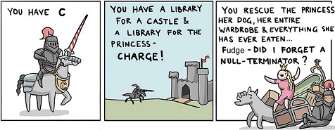

# C for Geeks

  

## Prerequisites

Windows users should set up WSL.

- basic commandline fu (navigation, file / folder manipulation, ...)
- your favourite text editor
- GCC / Clang installed

## Syllabus

- **Lecture -2:** mathematics background
    - numbers and their representation (base 2, 8, 10, 16)
    - bits and bytes, and their limitations
    - ASCII
    - boolean logic
    - bitwise operations
    - set theory
    - functions
    - types

- **Lecture -1:** computer architecture
    - CPU / memory
    - op-codes
    - locality

- **Lecture 0:** empty program
    - syntax
    - `void`
    - compiler warnings / errors

- **Lecture 1:** Hello World
    - use of standard library
    - man-pages

- **Lecture 2:** variables
    - types
    - assignment
    - `sizeof`
    - different ways to write a number
    - boolean in C

- **Lecture 3:** arithmetic

...
